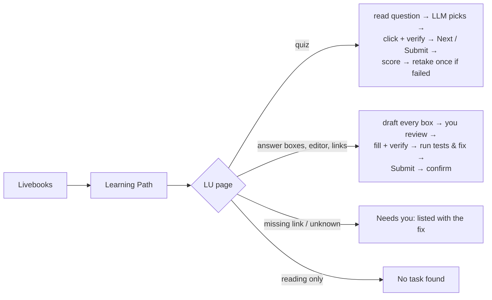

# kalbot: Kalvium assignment autopilot

[](https://github.com/gaurav-205/kalvium-quiz-automaion/actions/workflows/ci.yml)


kalbot opens your semester on [app.kalvium.community](https://app.kalvium.community), walks every
unfinished Learning Unit (LU) and completes it with an LLM (Gemini by default, Claude optional):
**quizzes, written answers, coding exercises, and GitHub / live-site / video link submissions.**
You review every written, coding and link submission before it goes in, unless you say `--auto`.

> **Read this first.** kalbot was built and tested against a local *mock* of the portal (see
> `tests/`); it has never seen the real Kalvium pages. It finds things by roles, visible text and
> page structure rather than brittle CSS classes, so it should cope with the real site. Your first
> run is still the real test, so follow **First run** in order. Every step says what it found
> before anything is submitted.

## What it does

| Assignment | What kalbot does |
|---|---|
| **Quiz (MCQ)** | Reads each question, code block and option (single or multi-select), asks the LLM with the LU's reading material as context, clicks and *verifies* the choice, moves on, submits, reads the score, and retakes once if it failed. |
| **Written / subjective** | Drafts each answer box from its question and the LU material, within the stated word limit (`minimum 200 words`, `150-300 words`, ...), in a student voice you can tune. A finished answer already in a box is kept; a template or half-written draft is filled in or completed. |
| **Coding** | Writes the solution into the editor (Monaco, CodeMirror 5/6, Ace or a plain textarea), keeping the starter code's signatures. If there's a **Run / Test** button, it runs the tests, feeds failures back to the LLM and fixes the code (twice by default) before submitting. |
| **GitHub repo link** | Uses the link from your `submissions.yaml`, or, with a `GITHUB_TOKEN`, generates a small project, shows you its files, creates the repo and submits its URL. Re-runs reuse the same repo. |
| **Live / deployed link** | From `submissions.yaml`, or GitHub Pages for a plain HTML/CSS/JS project kalbot created. |
| **Video link** | Only from `submissions.yaml`: record it, paste the link once, and kalbot submits it. |

It never half-submits. If an assignment asks for something kalbot doesn't have (your video link,
a fork-and-PR task), nothing in that assignment is submitted. The run summary lists it under
**Needs you** with the exact fix.



## Setup

You need **Python 3.10+** ([python.org](https://www.python.org/downloads/); on Windows tick *Add
python.exe to PATH*) and **Google Chrome**.

**Windows**

```bat
git clone https://github.com/gaurav-205/kalvium-quiz-automaion.git kalbot
cd kalbot
setup.bat
notepad .env
```

**macOS / Linux**

```sh
git clone https://github.com/gaurav-205/kalvium-quiz-automaion.git kalbot && cd kalbot
./setup.sh
source .venv/bin/activate
```

Put your key in `.env` (created from [`.env.example`](.env.example)). A free Gemini key is at
<https://aistudio.google.com/apikey>:

```ini
GEMINI_API_KEY=your-key-here
# optional, for "submit your GitHub repository" tasks:
GITHUB_TOKEN=github_pat_...
```

`.env` is gitignored and keys are never printed or logged. Plain environment variables (for
example `setx GEMINI_API_KEY ...`) work too and take precedence.

> On Windows, `setup.bat` creates a private environment in `.venv\` and a `kalbot.bat` launcher:
> type `kalbot ...` in Command Prompt or `.\kalbot ...` in PowerShell, from the kalbot folder.

## First run

1. **Check your setup:** `kalbot doctor` (add `--online` to test the API key and GitHub token).
2. **Log in and explore, read-only:** `kalbot discover`

   Chrome opens with its own profile (`browser_profile\`, not your normal Chrome). Log in to
   Kalvium there; kalbot waits up to 10 minutes. It then lists your livebooks, opens the first
   one's Learning Path and classifies a few LUs (*quiz behind a Start button*, *assignment:
   written (2 boxes)*, *assignment: links: github, video*, ...) without clicking anything that
   submits. It saves snapshots and a discovery report, and writes the selectors it verified into
   your `config.yaml`. You stay logged in for later runs.

   *If Google refuses the sign-in* ("This browser or app may not be secure"): close it, run
   `kalbot login` (plain Chrome on the same profile), log in, close that window, then run
   `kalbot discover` again.
3. **Preview one item:** `kalbot run --dry-run --limit 1`. It shows the first question and the
   LLM's pick, or the drafted answer, code or project, and submits nothing.
4. **Do one for real:** `kalbot run --limit 1`, then check it on the portal.
5. **Do everything:** `kalbot run`

## Commands

| Command | What it does |
|---|---|
| `kalbot run` | Complete every unfinished quiz and assignment in the semester (`run` is the default) |
| `kalbot run --dry-run` | Read and draft everything, show it, submit nothing |
| `kalbot run --limit 3` | Stop after 3 quizzes/assignments |
| `kalbot run --only quiz,written` | Only these kinds: `quiz`, `written`, `coding`, `links` |
| `kalbot run --livebook "web" --lu 2.3` | One livebook / one LU (also re-checks an LU marked complete) |
| `kalbot run --auto` | Hands-free: don't stop to review drafts |
| `kalbot run --semester 6` | Override `portal.semester` |
| `kalbot discover` | Read-only exploration, snapshots, selectors |
| `kalbot login` | Plain-Chrome login fallback |
| `kalbot doctor [--online]` | Check Python, packages, Chrome, keys, token, links file, config |

`Ctrl+C` stops cleanly and still writes the summary and report. `python -m kalbot ...` works too.

## Reviewing drafts

Before a written, coding or link assignment is typed into the portal, kalbot shows everything it
is about to submit: answers with word counts, code with syntax highlighting, links with where they
came from, and the file list of a repo it would create.

```
╭─ Review · Web Development · LU 1.4 Portfolio Website · links ────────────────────────╮
│  1. GitHub repository link  · new public repo, created when you submit · Portfolio … │
│     https://github.com/you/portfolio-website                                         │
│     files: README.md, index.html, script.js, style.css                               │
│  2. Live site link  · GitHub Pages                                                   │
│     https://you.github.io/portfolio-website/                                         │
│  3. Video link  · submissions.yaml                                                   │
│     https://www.loom.com/share/…                                                     │
╰──────────────────────────────────────────────────────────────────────────────────────╯
  [Enter] submit   [e] edit   [r] regenerate   [s] skip   [a] submit all from now on   [q] quit
```

`e` opens the draft in your editor (Notepad on Windows, `$EDITOR` elsewhere; for VS Code set
`EDITOR="code --wait"`). Quizzes never wait for review. Turn reviews off with `--auto`, or for good
with `run.review: false` in `config.yaml`. Without a terminal (scheduled runs, CI), drafts that
need review are saved and listed under **Needs you**, and nothing is submitted.

## Links: `submissions.yaml` and GitHub

Copy [`submissions.example.yaml`](submissions.example.yaml) to `submissions.yaml` and add the
links only you can provide:

```yaml
- livebook: Web Development   # part of the livebook name (optional)
  lu: "1.4"                   # LU number in quotes, or part of its title
  video: https://www.loom.com/share/abc123
  # github: / live: / pr: / link: work the same way
```

With `GITHUB_TOKEN` set, kalbot can create the repo for "submit your GitHub repository" tasks: it
asks the LLM for a small, complete project with a README, shows you the files, then creates a
public repo in one commit and, for plain HTML/CSS/JS projects, turns on GitHub Pages for the live
link. Created repos are remembered in `runs/state.json`, so a re-run reuses them. If an assignment
says to fork a repo or open a pull request, kalbot leaves it to you. The token needs repository
*Administration*, *Contents* and *Pages* write access (fine-grained), or the `repo` scope (classic).

## Settings

Your settings live in `config.yaml` (copy [`config.example.yaml`](config.example.yaml)); it only
needs what you change. Every option is documented in
[`kalbot/defaults.yaml`](kalbot/defaults.yaml). Typos are reported at start-up.

| You want to... | Setting |
|---|---|
| Use Claude instead of Gemini | `llm.provider: claude` + `ANTHROPIC_API_KEY` |
| Change how answers sound | `written.style` |
| Default length when no word limit is given | `written.default_words: [120, 250]` |
| Skip a kind of work for good | `tasks.coding: false` (etc.) |
| Never stop for review | `run.review: false` |
| Don't run tests / fewer fix rounds | `coding.run_tests`, `coding.max_fix_rounds` |
| Prefix or privatise created repos | `github.repo_prefix`, `github.private` |
| Slow portal | `timeouts.*` |
| Gemini free tier rate-limits you | `llm.min_seconds_between_calls: 6` |

## Output

Each run gets its own folder, `runs/<timestamp>/`:

| File | Contents |
|---|---|
| `report.html` | Open in a browser: every LU with its status, each question with the chosen option and confidence, each submitted answer, code and link |
| `results.csv` | One row per question / field / event; opens cleanly in Excel |
| `results.json` | The same results, machine-readable |
| `run.log` | Detailed technical log |
| `drafts/` | Every answer, code file and generated project, as submitted or previewed |
| `snapshots/`, `errors/` | HTML + screenshots of quiz pages, results, and every page that caused a skip |

## When something isn't recognised

Look at the snapshot in `runs/<timestamp>/errors/` or `snapshots/` (open the `.html` in Chrome and
use *Inspect*), or the discovery report, which lists buttons, inputs, editors and `data-*`
attributes. Then set the matching option in `config.yaml`:

| Symptom | Setting |
|---|---|
| No livebooks found | `selectors.livebook_card`, `selectors.livebook_href_regex`, `portal.semester` |
| Learning Path not opened | `selectors.learning_path_tab` (exact tab text) |
| LUs missing / modules not expanded | `selectors.lu_row`, `selectors.module_toggle`, `selectors.lu_number_regex` |
| Done/todo wrong on the Learning Path | `patterns.lu_completed` / `lu_not_completed`, or `run.trust_list_completion: false` |
| Quiz not found / not started | `texts.start`, `texts.tabs` |
| Quiz options or question text wrong | `selectors.quiz_option`, `selectors.quiz_question` |
| Answer boxes not found | `selectors.task_field`, `texts.task_submit` |
| A comment box was picked up | `patterns.task_exclude` |
| Wrong kind of link detected | `patterns.link_github`, `link_live`, `link_video`, `link_pr` |
| Run/Test output not understood | `texts.run`, `patterns.run_pass`, `patterns.run_fail` |
| Next / Submit / confirm not clicked | `texts.next`, `texts.submit`, `texts.confirm` |

Easiest fix of all: open this folder in [Claude Code](https://claude.com/claude-code) on your PC
and ask it to run `kalbot discover`, read the snapshots and adjust `config.yaml`. On your machine
it can see the real pages.

## Switching to Claude

Put `ANTHROPIC_API_KEY=...` in `.env` and set `llm.provider: claude` in `config.yaml`. The model is
`llm.models.claude` (default `claude-opus-5-5`; `claude-sonnet-5-5` or `claude-haiku-4-5` cost
less). With Claude, kalbot streams long answers, caches the LU material across an LU's questions,
sets effort per kind of work (`llm.effort`), and, if Claude declines a request, lets the API retry
it on a fallback model (`llm.refusal_fallback`). To add another provider, implement `complete()`
in a small class in `kalbot/llm.py` and register it in `PROVIDERS`.

## Safety rules

- kalbot clicks and types only into elements it has identified and marked. If the page isn't in
  the expected state (a missing button, a selection or text that didn't register, no confirmation
  after Submit), it saves a screenshot, skips that LU and carries on.
- Every typed answer is read back and compared before Submit; every quiz click is verified.
- Comment boxes, search bars and chat widgets are never touched. A box counts only if an
  assignment's Submit button follows it.
- LUs complete on the Learning Path, and anything already submitted, are skipped.
- A bad API key or exhausted quota stops the run instead of failing LU after LU. A GitHub token
  problem is reported on the LU that needed it, with the fix.
- Keep `browser_profile/` private: it holds your logged-in session. It's gitignored, along with
  `.env`, `config.yaml`, `submissions.yaml` and `runs/`.

## Development

```sh
pip install -e ".[dev]"
python -m playwright install chromium
ruff check .
python -m pytest              # all tests; `-m "not e2e"` for the fast ones only
```

The end-to-end tests start a local mock portal (`tests/mock_portal.py`) and a mock GitHub API, and
drive the real CLI with a fake LLM through login, discovery, dry-runs, a failed-then-retaken quiz,
written answers that need a rewrite to meet the word limit, a coding task whose first attempt fails
its tests, a repo + GitHub Pages + video link task, and a final run that must find nothing left.
`python tests/mock_portal.py` serves the mock on <http://127.0.0.1:8765> if you want to look at
it. No portal access or API key is needed.

| Path | Purpose |
|---|---|
| `kalbot/cli.py` | Commands, run setup, `doctor` |
| `kalbot/portal.py` | Login, livebooks, Learning Path, per-LU flow, discovery |
| `kalbot/quiz.py` | Quiz solver: extract, ask, select + verify, Next/Submit, result, retake |
| `kalbot/tasks.py` | Assignments: detect boxes, draft, review, fill + verify, run tests + fix, submit |
| `kalbot/llm.py`, `prompts.py` | Providers (Gemini, Claude), prompts, reply parsing and validation |
| `kalbot/links.py`, `github.py` | `submissions.yaml`, link kinds, repo creation and GitHub Pages |
| `kalbot/dom.js` | In-page detection of cards, LU rows, questions, options, answer boxes, editors, buttons |
| `kalbot/ui.py`, `report.py`, `runlog.py` | Terminal output and review prompt, HTML report, CSV/JSON log |
| `kalbot/config.py`, `defaults.yaml` | Settings: defaults + your `config.yaml` + `.env` |

## Responsible use

LLM answers can be wrong; low-confidence quiz answers are marked in the report. Whatever kalbot
submits goes in under your name. Graded written work, code and projects are held to your
institution's academic-integrity rules, and automated use may be against the portal's terms. The
review step exists so you can read and own every answer before it's submitted. Use kalbot on your
own account only.

Licensed under the [MIT License](LICENSE).
